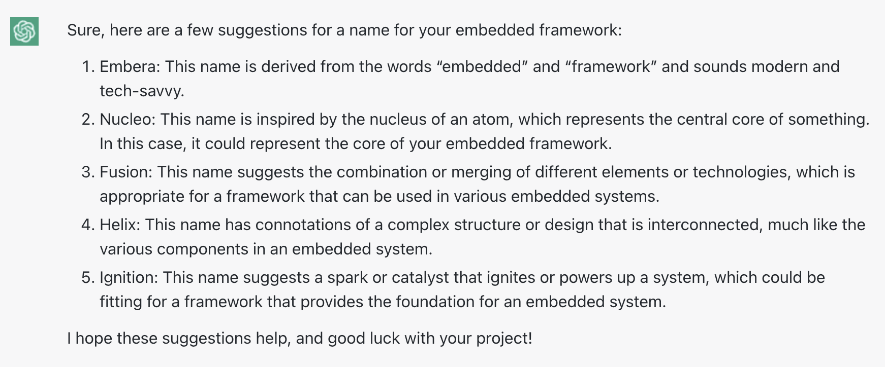

# Why Gembera
Gembera is a general embedded framework with C language. This name is basically an idea provided by chatgpt.



C language is one of the oldest languages. It is widely used and at same time heavily criticized. Many modern languages want to be "C/C++ killer", like Rust, Golang, Zig etc. They all try to solve part of the problems, but far from perfect. Gembera does not want to invent another wheel. It try to achieve the goal from the architectural level.

Main features:
* Ultra light framework for universal usages, from IoT, software defined vehicles to cloud native WebAssembly
* Build-in memory profiling and tracing
* Concurrent programming based on coroutines
* Pure C OOP implementation
* Package management with npm

# How to build
Make sure you have node.js in your system. Execute
```shell
npm install
```
to install necessary cross-platform command line tools.

* Debug version 
```shell
npm run debug:cmake
npm run debug:build
npm run debug:test
```
* Release version
```shell
npm run release:cmake
npm run release:build
npm run release:test
```
